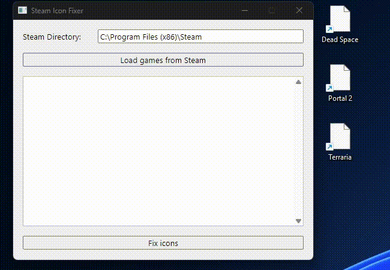

# SteamIconFix

**SteamIconFix** is a small program designed to fix missing Steam game icons. It aims to provide a quick user-friendly solution for ensuring that Steam shortcut icons are displayed correctly. It's especially useful after OS or Steam reinstallation.

## Features

* Quickly fixes Steam icons for all games (works with the ones without existing shortcuts, unlike some existing tools).
* Easy to use.
* Works locally without using any third-party services.
* Lightweight and (almost) portable*.

\* - The program cleans up created files on normal exit on Windows. In case of force exit, the files might remain in %AppData%.

## Usage

1. [Download the latest release](https://github.com/siva1danil/SteamIconFix/releases) (or compile the program yourself) and run the executable.
2. Type in your Steam directory (if not detected automatically).
3. Click "Load games from Steam".
4. Click "Fix icons" and wait.
5. Press "Refresh / F5" on your Desktop to reload the icons.
6. Done!

## System Requirements

* Windows (tested on Windows 11; might work on other OSes).  
* Steam must be installed.
* Any Steam game must be launched at least once.

## Demo

## TODO

* Check cross-platform compatibility.
* Check game compatibility.